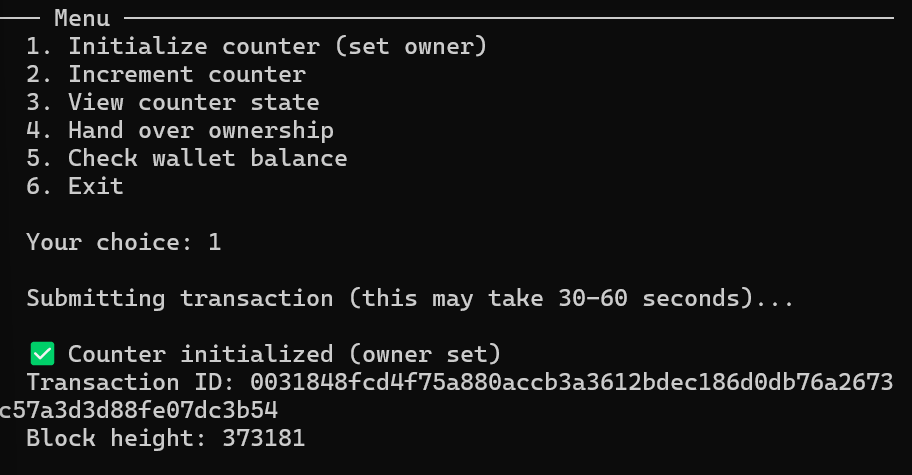
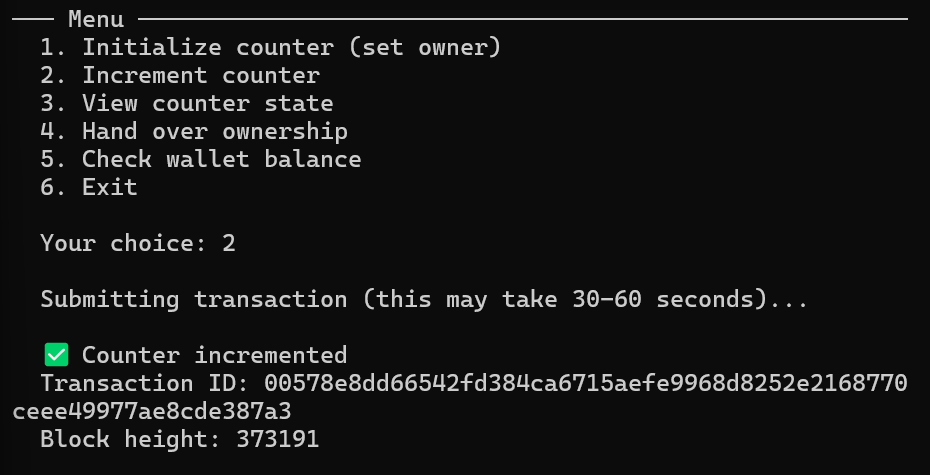
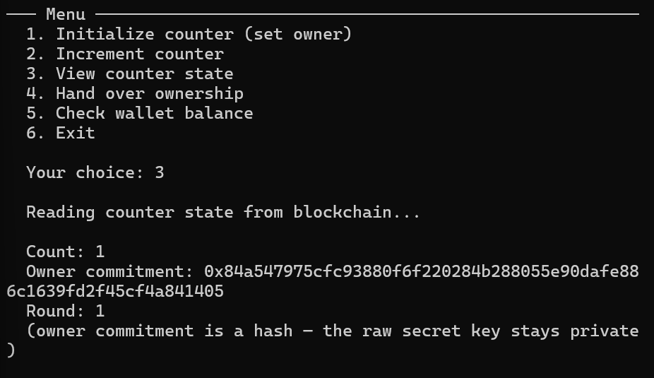

# Midnight Builder Challenge — Level 1: Counter Contract

A privacy-preserving on-chain counter built with the **Midnight Network** and the
**Compact** language. Level 1 of the [Midnight Builder Challenge](https://learn.midnight.network).

This project takes a simple public counter and makes it **privacy-aware**: the
owner's identity is a *commitment* on-chain, never the raw key. It also
demonstrates the Level 1 requirements — public ledger state, a private witness
as a circuit input, and a deliberate `disclose()`.

---

## Project Overview

| Component | What it is |
|---|---|
| **Contract** | `contracts/counter.compact` — public `count`, `owner` commitment, `round` |
| **Circuits** | `initialize`, `increment`, `handOver` |
| **Tests** | `tests/counter.test.ts` — 6 vitest cases, including privacy checks |
| **CLI** | `src/cli.ts` — interactive initialize/increment/view/hand-over |
| **E2E check** | `scripts/e2e-check.ts` — reconnect + query the deployed contract |

### Contract Addresses

| Contract | Network | Address |
|---|---|---|
| Hello World | Preview | `023961418ff144b7bbba58d5f3037922859872b09db069444cb8643ff3cdb0fc` |
| Counter | Preview | `c98aa869dc4ad4d227e9c5961457aaf4af2f8f345dc913235c631af5a776b49b` |

> Addresses are also recorded automatically in `.midnight-state.json`
> (gitignored — it holds the wallet seed).

---

## Initial Idea

The Midnight Builder Challenge is a hands-on program for learning how to write
zero-knowledge smart contracts on the Midnight Network using the Compact
language. It guides you through building and deploying real contracts across
multiple levels, starting from a minimal toolchain setup and a hello-world
deployment, then progressing to a contract with actual privacy guarantees.

As a solo participant, I chose to build a counter for Level 1 because it is
simple enough to understand every part of the circuit, yet deep enough to
demonstrate Midnight's core privacy model. The naive version is a public
number anyone can see and bump. My version flips that: the counter value is
still public, but ownership is proven with a zero-knowledge proof against a
one-way commitment on-chain, and the owner's secret key never leaves the local
machine. The Level 1 requirements — public ledger state, a private witness fed
into the circuit as input, and a deliberate `disclose()` — map directly onto
this design and make the privacy guarantees tangible and testable.

---

## Privacy Model

### Public ledger state

The contract's public state is a single `Ledger` struct:

```compact
export ledger Ledger {
  count: Uint<64>;
  owner: Bytes<32>;
  round: Counter<1>;
}
```

- `count` — the counter value, visible to everyone.
- `owner` — a **hash** of the owner's secret key, not the key itself.
- `round` — an anti-replay counter bumped on every owner transition.

### Private witness as a circuit input

The owner's secret key is **private state**, injected into each circuit through a
witness rather than being read from the ledger:

```compact
const sk = localSecretKey();
```

`localSecretKey()` is declared in the contract as a witness
(`unprovenfn localSecretKey() -> Bytes<32>`) and implemented in the DApp
(`tests/witnesses.ts` and `src/deploy.ts`). The runtime feeds it into the proof
from the local wallet's private state; it never touches the chain.

The on-chain commitment is computed from that secret key:

```compact
owner = publicKey(sk, round)
```

So anyone can verify the owner matches *some* key (ZKP), but nobody learns the key.

### Deliberate `disclose()`

Compact is privacy-by-default: **nothing is published unless explicitly
disclosed.** The contract deliberately discloses exactly the hashed owner
commitment so the counter's ownership transition is publicly verifiable:

```compact
owner = disclose(publicKey(newSecretKey, round as Field));
```

The raw `newSecretKey` is *not* disclosed — only its hash. See the comment block
at the top of `contracts/counter.compact` for the full reasoning.

### Privacy guarantee (proved by tests)

`tests/counter.test.ts` includes a test that serializes the entire public ledger
and asserts the raw secret key bytes never appear anywhere in it.

---

## Toolchain Setup (Step 1)

Midnight does not support Windows natively, so all toolchain work runs in **WSL
(Ubuntu)**. Verify your toolchain with:

| Tool | Version used | Notes |
|---|---|---|
| Node.js | 22.x | WSL via nvm |
| Docker | 27.x | Desktop, WSL2 backend |
| Compact CLI | 0.5.1 | `~/.local/bin/compact` |
| Compact compiler | 0.31.1 | `compact update` |
| Proof server | `midnightntwrk/proof-server:8.1.0` | port `6300` |

```bash
compact --version
compact compiler --version
docker compose ps   # proof-server up on :6300
```

> Windows quirk: WSL inherits `HOME` from Windows; always run with
> `HOME=/home/<user>` or use a helper that exports it (see `docs/`).

---

## Setup & Run

> Requires the proof server (and, for `preview`/`preprod`, a funded wallet).

```bash
npm install
npm run compile        # compact compile contracts/counter.compact managed/counter

# Local devnet (no wallet needed)
npm run setup          # starts node + indexer + proof-server, compiles, deploys

# Public network
npm run network preview
npm run deploy -- --network preview   # or: npm run setup -- --network preview
```

The first run creates a wallet and prints a 24-word recovery phrase — **write it
down**. Fund the printed address from the network faucet:

| Network | Faucet |
|---|---|
| Preview | <https://midnight-tmnight-preview.nethermind.dev> |
| Preprod | <https://midnight-tmnight-preprod.nethermind.dev> |

### Interact

```bash
npm run cli -- --network preview
```

Menu: **1** initialize · **2** increment · **3** view state · **4** hand over ·
**5** balance · **6** exit.

### Wallet commands

```bash
npm run check-balance -- --network preview
npm run network          # show active network + last deploy
```

---

## Run Tests

```bash
npm test                 # 6 vitest tests (contract simulates circuits locally)
npm run test:e2e -- --network preview   # reconnect + query the deployed contract
```

The unit tests run the real compiled circuits through a local `CounterSimulator`
(`tests/counter-simulator.ts`) without needing a chain, then verify:

1. deterministic initial state,
2. initialize binds the owner commitment,
3. increment is a valid state transition,
4. a non-owner secret key cannot authorize increments,
5. hand-over transfers ownership and replays are rejected,
6. private inputs never appear in public state.

---

## Project Structure

```
my-project/
├── contracts/counter.compact    # the Midnight (Compact) contract
├── managed/counter/             # generated: keys, contract, ZKIR, circuits
├── src/
│   ├── deploy.ts                # deploy + wallet/proof wiring
│   ├── cli.ts                   # interactive CLI
│   ├── setup.ts                 # orchestrated setup
│   ├── network.ts               # network/wallet/state helpers
│   └── wallet.ts                # wallet sync helpers
├── tests/
│   ├── counter.test.ts          # 6 tests
│   ├── counter-simulator.ts     # local circuit runner
│   └── witnesses.ts             # private-state type + witness impl
├── scripts/e2e-check.ts         # read-only on-chain smoke check
└── docker-compose.yml           # local devnet (node, indexer, proof-server)
```

---

## Screenshots

### Successful compile output


### Contract deployed with address


### Initialize



### Increment



### View state



---

## Final Checklist

| Requirement | Status |
|---|---|
| Step 1 — toolchain installed & verified (WSL) | ✅ |
| Step 1 — proof server running | ✅ |
| Step 3 — hello-world deployed to preview | ✅ |
| Step 4 — counter contract written (`counter.compact`) | ✅ |
| Step 4 — public ledger state | ✅ |
| Step 4 — private witness as circuit input (`localSecretKey`) | ✅ |
| Step 4 — deliberate `disclose()` + comment block | ✅ |
| Step 5 — 3+ tests | ✅ (6 tests) |
| Step 6 — README with all required sections | ✅ |
| Contract address in README | ✅ |
| 5+ meaningful commits | ✅ (7 commits) |

---

## License

MIT
